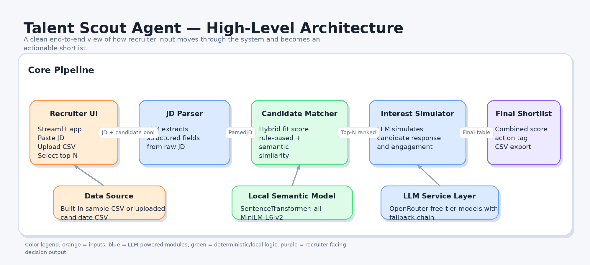
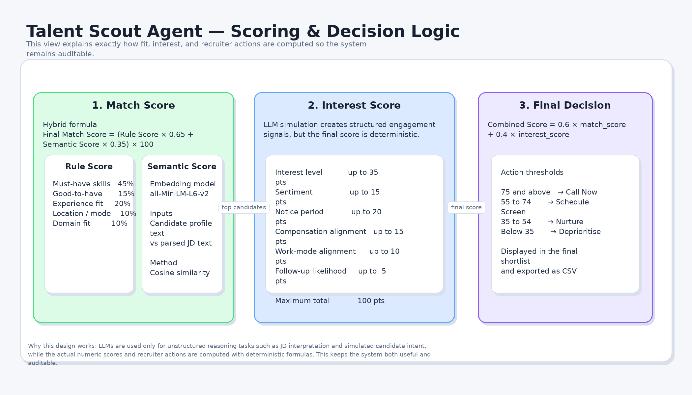

# 🎯 Talent Scout Agent

> **AI-powered candidate discovery, matching, and interest simulation for recruiters.**
>
> Built for a solo AI Agent hackathon. Solves a real recruiting pain point end-to-end: given a job description and a candidate pool, the agent parses the JD, scores every candidate using a deterministic hybrid algorithm, simulates outreach responses using a free LLM, and produces a ranked, actionable shortlist — all in a single Streamlit session.

---

## Quick Links

| | Link |
|---|---|
| 🔗 **Live Demo** | *Coming soon — deploying to Streamlit Community Cloud* |
| 🎥 **Demo Video** | *Coming soon — recording in progress* |
| 📁 **Source Code** | [github.com/The-Harsh-Goyal/talent-scout-agent](https://github.com/The-Harsh-Goyal/talent-scout-agent) |
| 📂 **Sample I/O** | [`samples/`](https://github.com/The-Harsh-Goyal/talent-scout-agent/tree/main/samples) |

---


## Table of Contents

1. [Problem Statement](#1-problem-statement)
2. [Solution Overview](#2-solution-overview)
3. [Architecture](#3-architecture)
4. [Module Deep-Dive](#4-module-deep-dive)
   - [LLM Client — `src/llm_client.py`](#41-llm-client--srclm_clientpy)
   - [JD Parser — `src/jd_parser.py`](#42-jd-parser--srcjd_parserpy)
   - [Candidate Matcher — `src/matcher.py`](#43-candidate-matcher--srcmatcherpy)
   - [Interest Simulator — `src/interest_simulator.py`](#44-interest-simulator--srcinterest_simulatorpy)
   - [Streamlit App — `app.py`](#45-streamlit-app--apppy)
5. [Scoring Logic Explained](#5-scoring-logic-explained)
   - [Match Score (Hybrid)](#51-match-score-hybrid)
   - [Interest Score (Deterministic)](#52-interest-score-deterministic)
   - [Combined Score and Recruiter Action](#53-combined-score-and-recruiter-action)
6. [Data Schema](#6-data-schema)
7. [Local Setup](#7-local-setup)
8. [Project Structure](#8-project-structure)
9. [Tools & Stack Declared](#9-tools--stack-declared)
10. [Constraints & Design Decisions](#10-constraints--design-decisions)
11. [Sample Input and Output](#11-sample-input-and-output)
12. [What the Agent Does NOT Do (Honest Scope)](#12-what-the-agent-does-not-do-honest-scope)
13. [Future Improvements](#13-future-improvements)

---

## 1. Problem Statement

Recruiting is fundamentally an information matching problem — but it is broken at both ends.

**On the recruiter side:** A recruiter receives a job description and a spreadsheet of hundreds of candidates. They manually scan CVs, keyword-match skills, and make gut-level guesses about who might be interested and available. This is slow, inconsistent, and biased toward surface-level signals like job titles and keywords.

**On the candidate side:** Recruiters send cold outreach without knowing whether a candidate is actually open to a role. A candidate with a 90-day notice period, a salary expectation far above the band, or a strong preference against onsite work is a low-probability hire — but a recruiter typically only discovers this after scheduling multiple screens.

**The gap this agent closes:**

> Given a job description and a candidate pool, produce a ranked shortlist that scores each candidate on both *fit* (how well their skills and experience match the role) and *likelihood to engage* (how likely they are to be interested, available, and willing to proceed) — before a single conversation happens.

---

## 2. Solution Overview

The agent runs a **three-step pipeline** triggered by a single button click:

```
JD Text Input
     │
     ▼
┌─────────────────────────────────────┐
│  Step 1: JD Parser (LLM)            │
│  Converts freeform JD text into     │
│  a structured JSON object.          │
└─────────────────────────────────────┘
     │ Parsed JD dict
     ▼
┌─────────────────────────────────────┐
│  Step 2: Candidate Matcher          │
│  Hybrid rule-based + semantic       │
│  scoring. Produces a match score    │
│  out of 100 for every candidate.    │
└─────────────────────────────────────┘
     │ Ranked + shortlisted candidates
     ▼
┌─────────────────────────────────────┐
│  Step 3: Interest Simulator (LLM)   │
│  For each shortlisted candidate,    │
│  simulates a realistic outreach     │
│  response and extracts structured   │
│  engagement signals. Computes an    │
│  interest score out of 100.         │
└─────────────────────────────────────┘
     │ Final DataFrame
     ▼
┌─────────────────────────────────────┐
│  Final Shortlist                    │
│  Combined score = 60% match +       │
│  40% interest. Sorted, tagged with  │
│  recruiter action, exportable.      │
└─────────────────────────────────────┘
```

The agent produces **per-candidate explainability** at every stage: which skills were matched, which were missing, what the simulated candidate said, and what action the recruiter should take.

---

## 3. Architecture

### High-level architecture



This diagram shows the end-to-end pipeline from recruiter input to final shortlist generation.

### Scoring and decision logic



This diagram isolates the scoring system so judges can quickly understand how fit, interest, and recruiter actions are computed.

### Repository structure view

```text
talent-scout-agent/
│
├── app.py                     # Streamlit UI — orchestrates the full pipeline
│
├── src/
│   ├── __init__.py
│   ├── llm_client.py          # OpenRouter API client with free-model fallback chain
│   ├── jd_parser.py           # LLM-powered JD → structured JSON parser
│   ├── matcher.py             # Hybrid rule-based + semantic candidate scorer
│   └── interest_simulator.py  # LLM-powered candidate interest simulation
│
├── data/
│   └── candidates.csv         # Built-in sample candidate pool (12 candidates)
│
├── assets/
│   ├── architecture_high_level.png
│   └── architecture_scoring_logic.png
│
├── .env.example               # Environment variable template
├── requirements.txt           # All Python dependencies (pinned versions)
├── LICENSE
└── readME.md
```

**Data flow summary:**

1. `app.py` receives user input (JD text + optional CSV upload).
2. `jd_parser.py` → calls `llm_client.py` → returns a `ParsedJD` Pydantic object.
3. `matcher.py` consumes the candidate DataFrame and the parsed JD dict → returns a ranked DataFrame with match scores, skill overlap, and explainability strings.
4. `interest_simulator.py` → calls `llm_client.py` per top-N candidate → returns a `CandidateInterestSignals` Pydantic object per candidate.
5. `app.py` combines match score and interest score → computes a `combined_score` → assigns `recruiter_action` → renders the final shortlist.

---

## 4. Module Deep-Dive

### 4.1 LLM Client — `src/llm_client.py`

**Purpose:** Single point of contact for all LLM calls in the project. Abstracts away API complexity and implements a multi-model fallback chain so the application degrades gracefully when free-tier rate limits are hit.

**Why OpenRouter instead of direct API calls?**

OpenRouter exposes a unified OpenAI-compatible API (`/v1/chat/completions`) that can route to dozens of models — including several free-tier options — under one API key. This was a deliberate choice to satisfy the hackathon constraint of _"stay within free/trial tiers"_ without managing multiple API keys or SDKs.

**Why a fallback chain?**

Free-tier models on OpenRouter have aggressive rate limits (often 10–20 requests per minute per model). In a pipeline where the interest simulator calls the LLM once per shortlisted candidate (e.g., 5–10 times per run), hitting a rate limit on a single model would crash the entire agent. The fallback chain (`FREE_MODEL_FALLBACKS`) tries models in priority order, catches `RateLimitError`, waits briefly, and moves to the next model — ensuring the pipeline completes even under rate pressure.

**Model priority order (by reliability):**

```python
FREE_MODEL_FALLBACKS = [
    "mistralai/mistral-7b-instruct:free",   # Most reliable JSON output
    "meta-llama/llama-3.1-8b-instruct:free",
    "google/gemma-3-1b-it:free",
    "google/gemma-3-4b-it:free",
    "microsoft/phi-3-mini-128k-instruct:free",
    "openchat/openchat-7b:free",
    "huggingfaceh4/zephyr-7b-beta:free",
    "nvidia/nemotron-3-super-120b-a12b:free",
    "nvidia/nemotron-3-nano-30b-a3b:free",
    "openai/gpt-oss-120b:free"
]
```

**Key design decisions:**

- `response_format={"type": "json_object"}` is passed when a JSON response is required. This forces JSON mode on models that support it, dramatically reducing malformed responses.
- Models that return `None` or empty string content are skipped immediately without waiting — this prevents silent failures when a model returns a tool-call completion instead of text.
- All errors are logged with `print()` so failures are visible in the Streamlit terminal without crashing the UI.

---

### 4.2 JD Parser — `src/jd_parser.py`

**Purpose:** Converts a raw, unstructured job description (copy-pasted freeform text) into a typed, validated Python object that the rest of the pipeline can consume reliably.

**Why this step is necessary:**

Job descriptions are written by humans for humans. They use inconsistent formatting, mix must-have and nice-to-have requirements in the same paragraph, and spell skill names differently across companies ("Structured Query Language" vs "SQL", "PySpark" vs "Apache Spark"). A downstream rule-based matcher operating directly on raw JD text would produce garbage results. Parsing the JD first into a clean, normalized schema makes every downstream step deterministic.

**Schema (`ParsedJD` Pydantic model):**

| Field | Type | Purpose |
|---|---|---|
| `job_title` | str | Normalized role name |
| `seniority` | str | Junior / Mid / Senior / Lead |
| `min_years_experience` | float | Minimum YOE required |
| `max_years_experience` | float or None | Upper bound (for overqualification check) |
| `location` | str | City / country |
| `work_mode` | str | Remote / Hybrid / Onsite |
| `employment_type` | str | Full-time / Contract / etc. |
| `must_have_skills` | List[str] | Non-negotiable skills |
| `good_to_have_skills` | List[str] | Preferred but optional skills |
| `domain_experience` | List[str] | Industry/domain context (FinTech, SaaS, etc.) |
| `responsibilities` | List[str] | Role duties |
| `keywords` | List[str] | Remaining contextual keywords |
| `summary` | str | 1–2 sentence human-readable summary |

**Defensive parsing — why so much guard code?**

Free-tier LLMs are unreliable. Known failure modes observed during development:

1. **Markdown fences in JSON response** — models like Gemma and Phi sometimes wrap the JSON in ` ```json ` despite being instructed not to. The parser strips these defensively.
2. **Returning strings instead of lists** — some models return `"must_have_skills": "Python, SQL, Azure"` instead of `["Python", "SQL", "Azure"]`. The parser recovers this by splitting on commas.
3. **Returning floats instead of integers** — `"min_years_experience": "5 years"` or `"5+"`. The parser coerces all numeric fields with `float()`.
4. **JSON decode failure** — if the model returns completely unparseable content, the parser falls back to the empty `ParsedJD()` defaults rather than crashing, and logs the raw output for debugging.

Pydantic validation is used as a final safety net, not as the primary parse path — because by the time Pydantic runs, the dict has already been cleaned.

---

### 4.3 Candidate Matcher — `src/matcher.py`

**Purpose:** Score every candidate against the parsed JD and return a ranked DataFrame. This is the core intelligence of the agent.

**Why a hybrid approach?**

A purely rule-based approach (keyword matching) cannot handle semantic variation. A candidate who lists "PySpark" and a JD that asks for "Apache Spark" are referring to the same technology — but exact string matching fails here. Conversely, a purely semantic approach (cosine similarity of embeddings) cannot enforce hard constraints like "must have 5+ years experience" or "must know SQL". The hybrid approach combines the strengths of both:

| Layer | Method | Captures |
|---|---|---|
| Rule-based (65% weight) | Skill overlap, experience, location, domain | Hard constraints, explicit requirements |
| Semantic (35% weight) | Sentence Transformer cosine similarity | Conceptual alignment, synonyms, context |

**Rule-based sub-scores:**

| Sub-score | Weight within rule score | Logic |
|---|---|---|
| Must-have skill overlap | 45% | % of must-have skills present in candidate profile |
| Good-to-have skill overlap | 15% | % of nice-to-have skills matched |
| Experience fit | 20% | Proportional penalty below minimum; overqualification penalty above max+3 |
| Location / work mode | 10% | Full match=1.0, partial=0.8, remote override=1.0, mismatch=0.4 |
| Domain relevance | 10% | Partial string matching between candidate domains and JD domains |

**Why 65/35 rule/semantic split?**

The must-have skill match dominates the rule score at 45%, which means a candidate who is missing critical hard skills cannot be rescued by semantic similarity alone. This is intentional — a JD asking for "Azure Databricks" should not shortlist a candidate who only knows "AWS Redshift" just because both are cloud data platforms. The semantic layer serves as a tiebreaker and context enricher, not a hard filter override.

**Semantic scoring:**

Uses `all-MiniLM-L6-v2` from `sentence-transformers` (a 22M parameter model that runs entirely locally — no external API calls, no cost, no rate limits). Candidate profiles and the JD are each converted to a single text block, embedded, and compared via cosine similarity.

The model is lazy-loaded on first use (not at import time) to avoid blocking the Streamlit app on startup. This is important because `SentenceTransformer` loads a ~80MB model into memory; doing it synchronously at import would make the app appear frozen.

**Batch embedding:**

All candidate embeddings are computed in a single `model.encode()` call (not one per candidate), which is significantly faster due to batched GPU/CPU matrix operations.

**Explainability:**

Every candidate receives a natural-language `explainability` string that describes why they scored the way they did, e.g.:

> _"Matched must-have skills: python, sql, azure. Missing must-have skills: databricks. Experience is a strong fit (6 yrs). Location/work mode fully aligned. Strong domain relevance. High semantic profile-JD alignment (78.3%)."_

This is generated from the scoring intermediates, not from the LLM, which means it is deterministic and always accurate.

---

### 4.4 Interest Simulator — `src/interest_simulator.py`

**Purpose:** For each shortlisted candidate, simulate a realistic recruiter outreach scenario and extract structured engagement signals that predict whether the candidate will actually respond positively and progress through the hiring funnel.

**Why simulate rather than score statically?**

Static scoring (rule-based interest prediction) cannot account for nuance. A candidate who has been "passive" for 12 months but whose current role is a poor title-to-skill fit may actually respond very positively to the right opportunity. Conversely, a candidate marked "active" who is over-leveled for the role and under-compensated by the band may immediately disengage. The LLM simulation generates a realistic candidate voice given the full context — title, salary expectations, notice period, work mode preference, domain fit, and the specific JD — which surfaces these dynamics in a way that static rules cannot.

**Schema (`CandidateInterestSignals` Pydantic model):**

| Field | Allowed Values | Meaning |
|---|---|---|
| `simulated_response` | Free text | The candidate's first response to outreach |
| `interest_level` | high / medium / low / not_interested | Overall engagement level |
| `sentiment` | positive / neutral / negative | Emotional tone of response |
| `notice_period_days` | int or None | When candidate can join |
| `compensation_alignment` | aligned / negotiable / misaligned / unknown | Salary fit |
| `work_mode_alignment` | aligned / partially_aligned / misaligned / unknown | Work style fit |
| `follow_up_likelihood` | high / medium / low | Will candidate engage in next step? |
| `key_signals` | List[str] | Short bullet reasons for their stance |
| `summary` | str | One-paragraph recruiter-facing summary |

**Why strict enum validation?**

Free LLMs frequently hallucinate field values outside the defined set — returning `"very_high"` instead of `"high"`, or `"somewhat_aligned"` instead of `"partially_aligned"`. Every enum field is validated against its allowed set post-parse, and invalid values are reset to safe defaults with a log message. This prevents downstream scoring from silently producing wrong numbers.

**Why deterministic interest scoring on top of LLM output?**

The LLM provides qualitative signals, but the final interest score is computed from those signals using a fixed formula — not generated by the LLM. This is a deliberate design choice for two reasons:

1. **Reproducibility.** The LLM simulation may vary between runs (even at temperature=0, different models produce different outputs). Making the score formula deterministic means the score is a pure function of the signal values, not of LLM randomness.
2. **Auditability.** A recruiter (or a judge) can inspect exactly how the interest score was derived and challenge the formula, whereas an LLM-generated score of "72 out of 100" is a black box.

---

### 4.5 Streamlit App — `app.py`

**Purpose:** Orchestrates the full pipeline and renders the results in a usable, recruiter-friendly UI.

**Key UI decisions:**

- **Sections are numbered 1–8.** This mirrors how a recruiter actually thinks about the workflow: candidate pool → JD input → parse → match → simulate → shortlist → detail → export. Judges can follow the flow instantly.
- **`st.spinner()` at every async step.** JD parsing and interest simulation are the slowest steps (network calls to OpenRouter). Spinners with step labels ("Step 1/3 — Parsing...") prevent the UI from appearing frozen.
- **Progress bar during interest simulation.** Since interest simulation runs N times (once per candidate), a per-candidate progress bar provides real-time feedback. The `st.empty()` pattern is used to replace the status text label on each iteration rather than appending N separate text elements.
- **Per-candidate detail expanders.** The final shortlist is a DataFrame (good for scanning), but recruiters need depth per candidate. Collapsible expanders under "Candidate Detail View" present scores, engagement signals, the simulated response, and the explainability text together — without requiring a new page or route.
- **Recruiter action as colored emoji prefix.** 🟢 Call Now / 🔵 Schedule Screen / 🟡 Nurture / 🔴 Deprioritise gives instant visual triage at the expander header level — the recruiter does not need to open the expander to understand priority.
- **CSV upload fallback.** The app uses the built-in `data/candidates.csv` when no file is uploaded. This ensures the demo always works even without a custom dataset, which is critical for a live hackathon presentation.

---

## 5. Scoring Logic Explained

### 5.1 Match Score (Hybrid)

```
Final Match Score (0–100) = 
    (Rule-Based Score × 0.65 + Semantic Score × 0.35) × 100
```

**Rule-Based Score (0–1):**

```
Rule Score = 
    Must-Skill Overlap     × 0.45
  + Good-Skill Overlap     × 0.15
  + Experience Score       × 0.20
  + Location/Mode Score    × 0.10
  + Domain Score           × 0.10
```

**Experience Score logic:**

```
if candidate_exp < min_exp:
    score = 1.0 - min(shortfall / min_exp, 1.0)   # Proportional penalty
elif candidate_exp > max_exp + 3:
    score = 0.70                                    # Overqualified penalty
else:
    score = 0.85 + min((candidate_exp - min_exp) / max(min_exp, 5), 0.15)
```

The overqualification threshold of `max_exp + 3` was chosen because a candidate who is 4+ years above the role ceiling is statistically unlikely to accept the offer without significant non-salary incentives.

**Semantic Score logic:**

```
JD Text = job_title | summary | must_have_skills | good_to_have_skills | 
           domain_experience | keywords | seniority | location | work_mode

Candidate Text = current_title | summary | skills | domain_experience | 
                  current_company | years_experience | location | work_mode

Semantic Score = cosine_similarity(embed(JD Text), embed(Candidate Text))
```

Model: `all-MiniLM-L6-v2` (local, free, no API calls).

---

### 5.2 Interest Score (Deterministic)

```
Interest Score (0–100) =
    Interest Level Score     (0–35 pts)
  + Sentiment Score          (0–15 pts)
  + Notice Period Score      (0–20 pts)
  + Compensation Alignment   (0–15 pts)
  + Work Mode Alignment      (0–10 pts)
  + Follow-up Likelihood     (0–5 pts)
```

**Point allocation:**

| Signal | Values → Points |
|---|---|
| Interest level | high=35, medium=22, low=10, not_interested=0 |
| Sentiment | positive=15, neutral=8, negative=0 |
| Notice period | ≤30 days=20, ≤60 days=12, >60 days=5, unknown=8 |
| Compensation | aligned=15, negotiable=10, misaligned=0, unknown=6 |
| Work mode | aligned=10, partially_aligned=5, misaligned=0, unknown=4 |
| Follow-up likelihood | high=5, medium=3, low=0 |

**Why "unknown" values receive partial credit** instead of zero: A candidate with unknown compensation alignment or work mode alignment has not said "no" — they are an open question. Penalizing them to zero would bias the shortlist toward candidates who happen to have complete profile data, not toward better candidates.

---

### 5.3 Combined Score and Recruiter Action

```
Combined Score (0–100) = Match Score × 0.60 + Interest Score × 0.40
```

**Why 60/40 split?**

Match score captures objective skill and experience fit, which is harder to change. Interest score captures behavioral intent, which is softer and more context-dependent. A 60/40 weighting biases the final ranking toward fit-first while still meaningfully rewarding high-interest, available candidates over well-matched but unresponsive ones.

**Recruiter action thresholds:**

| Combined Score | Action | Rationale |
|---|---|---|
| ≥ 75 | 🟢 Call Now | Strong fit + strong interest. Highest ROI on recruiter time. |
| 55–74 | 🔵 Schedule Screen | Good fit or good interest. Worth a 30-minute screen. |
| 35–54 | 🟡 Nurture | Partial fit or low engagement. Keep warm, revisit in 30–60 days. |
| < 35 | 🔴 Deprioritise | Neither fit nor intent justifies near-term effort. |

---

## 6. Data Schema

### Candidate CSV Schema

The built-in `data/candidates.csv` and any uploaded CSV must conform to the following schema:

| Column | Type | Required | Notes |
|---|---|---|---|
| `candidate_id` | str | ✅ | Unique identifier, e.g. C001 |
| `name` | str | ✅ | Full name |
| `current_title` | str | ✅ | Current job title |
| `years_experience` | float | ✅ | Total years of professional experience |
| `location` | str | ✅ | City or city, country |
| `work_mode` | str | ✅ | Remote / Hybrid / Onsite |
| `skills` | str | ✅ | Semicolon-separated skill list, e.g. `Python; SQL; Azure` |
| `domain_experience` | str | ✅ | Comma-separated domains, e.g. `FinTech, SaaS` |
| `current_company` | str | ✅ | Employer name |
| `summary` | str | ✅ | 1–2 sentence professional summary |
| `notice_period_days` | int | ✅ | Days to join, e.g. 30, 60, 90 |
| `expected_salary_lpa` | float | ✅ | Expected CTC in LPA (Indian context) |
| `candidate_status` | str | ✅ | `active`, `passive`, or `not_looking` |
| `education` | str | ❌ | Optional. Not used in scoring. |
| `email` | str | ❌ | Optional. For display only. |
| `linkedin_url` | str | ❌ | Optional. For display only. |

> **Note on `skills` separator:** The matcher splits on `"; "` (semicolon + space). If your CSV uses commas to separate skills, update the split logic in `compute_skill_overlap()` in `matcher.py`.

---

## 7. Local Setup

### Prerequisites

- Python 3.10 or higher
- A free [OpenRouter](https://openrouter.ai) account and API key
- Git

### Step 1 — Clone the repository

```bash
git clone https://github.com/The-Harsh-Goyal/talent-scout-agent.git
cd talent-scout-agent
```

### Step 2 — Create a virtual environment

```bash
python -m venv venv
source venv/bin/activate        # macOS / Linux
venv\Scripts\activate           # Windows
```

### Step 3 — Install dependencies

```bash
pip install -r requirements.txt
```

> **Note:** `sentence-transformers` downloads the `all-MiniLM-L6-v2` model (~80MB) on first run from HuggingFace Hub. Ensure you have an active internet connection on first launch.

### Step 4 — Configure environment variables

```bash
cp .env.example .env
```

Open `.env` and add your OpenRouter API key:

```
OPENROUTER_API_KEY=sk-or-v1-xxxxxxxxxxxxxxxxxxxxxxxxxxxxxxxx
```

The `OPENROUTER_MODEL` variable in `.env.example` is present for reference but is not required — the fallback chain in `llm_client.py` manages model selection automatically.

### Step 5 — Run the app

```bash
streamlit run app.py
```

The app will open at `http://localhost:8501` in your default browser.

### Step 6 — Use the app

1. **Upload a candidate CSV** (optional) — or use the built-in 12-candidate sample pool.
2. **Paste a job description** into the text area.
3. **Adjust the top-N slider** (3–20 candidates).
4. **Click "▶ Run Talent Scout Agent".**
5. Review the parsed JD → match results → interest simulation → final shortlist.
6. **Download the shortlist** as CSV using the export button.

---

## 8. Project Structure

```
talent-scout-agent/
│
├── app.py                        # Main Streamlit application
│
├── src/
│   ├── __init__.py               # Package initializer (empty)
│   ├── llm_client.py             # OpenRouter API wrapper + fallback chain
│   ├── jd_parser.py              # LLM-powered JD → ParsedJD pipeline
│   ├── matcher.py                # Hybrid rule-based + semantic candidate scorer
│   └── interest_simulator.py     # LLM-powered interest simulation + scoring
│
├── data/
│   └── candidates.csv            # 12-candidate sample pool for demo
│
├── .env.example                  # Template for required env vars
├── .gitignore                    # Excludes .env, __pycache__, venv, etc.
├── requirements.txt              # Pinned dependency list
├── LICENSE                       # MIT License
└── readME.md                     # This file
```

---

## 9. Tools & Stack Declared

| Tool / Library | Version | Purpose | Tier |
|---|---|---|---|
| Python | 3.10+ | Core language | Free |
| Streamlit | 1.56.0 | Web UI framework | Free |
| OpenRouter API | — | LLM routing to free models | Free tier |
| Mistral 7B Instruct | free | Primary LLM for JD parsing + interest simulation | Free |
| Llama 3.1 8B Instruct | free | Fallback LLM #2 | Free |
| Gemma 3 (1B, 4B) | free | Fallback LLMs #3, #4 | Free |
| Phi-3 Mini 128K | free | Fallback LLM #5 | Free |
| OpenChat 7B | free | Fallback LLM #6 | Free |
| Zephyr 7B Beta | free | Fallback LLM #7 | Free |
| NVIDIA Nemotron (120B, 30B) | free | Fallback LLMs #8, #9 | Free |
| OpenAI GPT-OSS 120B | free | Fallback LLM #10 | Free |
| sentence-transformers | 5.4.1 | Local semantic embedding model | Free / Local |
| all-MiniLM-L6-v2 | — | Embedding model (HuggingFace) | Free / Local |
| Pydantic | 2.13.3 | Data validation and schema enforcement | Free |
| pandas | 3.0.2 | DataFrame operations | Free |
| numpy | 2.4.4 | Numerical operations | Free |
| python-dotenv | 1.2.2 | Environment variable loading | Free |
| openai SDK | 2.32.0 | OpenAI-compatible HTTP client (used for OpenRouter) | Free |

> **No paid API credits were used in building or running this agent.** All LLM calls go through OpenRouter's free-tier models. The semantic embedding model runs locally with no API calls.

---

## 10. Constraints & Design Decisions

### Constraint 1 — Free-tier LLMs are rate-limited and unreliable

**Problem:** Free models on OpenRouter allow roughly 10–20 requests per minute. In a pipeline where the interest simulator calls the LLM once per shortlisted candidate, hitting a rate limit mid-run would crash the entire pipeline. Additionally, free models frequently:
- Return `None` content when they generate a tool-call instead of a text completion.
- Wrap JSON in markdown code fences despite instructions not to.
- Return enum values outside the allowed set.
- Return strings instead of lists for array fields.

**Decision:** Build a 10-model fallback chain in `llm_client.py` that catches rate limit errors, retries once with a delay, and then falls to the next model. All response parsing includes defensive guards for every known failure mode. The app surfaces user-friendly error messages ("All AI models are currently rate-limited. Please wait 30 seconds.") instead of raw stack traces.

**Trade-off:** The fallback chain adds latency when primary models are rate-limited. A run that encounters two model failures before succeeding may take 30–40 seconds for a single LLM call. This is an acceptable trade-off for a free-tier system.

---

### Constraint 2 — No database or persistent state

**Problem:** Streamlit reruns the entire script on every user interaction. There is no session-persistent database, no caching layer, and no ability to store results between runs without external services (which would require paid infrastructure).

**Decision:** All state lives in-memory within a single Streamlit session. Results are surfaced in the UI immediately and can be exported via the CSV download button. The sentence transformer model is cached via a global Python variable (`_EMBEDDING_MODEL`) to avoid reloading the 80MB model on every run-button click.

**Trade-off:** Results are lost on page refresh. For a hackathon prototype, this is acceptable. In production, results would be persisted to a database between sessions.

---

### Constraint 3 — No live candidate data source

**Problem:** A real talent scout agent would connect to an ATS (Applicant Tracking System), LinkedIn API, or internal HR database. None of these are freely accessible without enterprise agreements or paid plans.

**Decision:** Use a structured CSV as the candidate data source. This is semantically equivalent to an ATS query result — it is the same data format that most ATS exports produce. The upload-or-use-default pattern means the demo always works, and judges with their own candidate data can test the agent with a real pool.

**Trade-off:** The agent does not crawl or discover candidates autonomously. This limits the "innovation" dimension but dramatically improves reliability and deployability within free-tier constraints.

---

### Constraint 4 — Skill matching is exact string match (after normalization)

**Problem:** Exact string matching fails on synonyms: "PySpark" ≠ "Apache Spark", "ADF" ≠ "Azure Data Factory", "k8s" ≠ "Kubernetes".

**Decision:** Partial mitigation via the semantic scoring layer (35% of match score). The semantic model captures conceptual similarity and partially recovers synonym mismatches. A more complete solution would be a skills taxonomy/ontology (e.g., mapping "PySpark" → "Apache Spark" → "Distributed Computing"), but this requires a maintained skills database that was out of scope.

**Acknowledged limitation:** A candidate who lists "PySpark" will not receive must-skill credit for a JD that requires "Spark" under the rule-based layer, even though they are the same technology. The semantic layer will boost their score, but not as much as an exact match would.

---

### Constraint 5 — Interest simulation is a proxy, not real outreach

**Problem:** Real candidate interest is unknown without actually contacting them. The simulation is an LLM's best estimate of how a candidate might respond, not a ground truth.

**Decision:** This is explicitly a _simulation_ — the agent's value is not in predicting with certainty whether a candidate will respond, but in **prioritizing outreach effort**. A recruiter with 50 candidates to reach should contact the "Call Now" candidates first. Even if the simulation is 70% accurate, it is significantly better than random ordering. The simulated response text also gives recruiters a starting point for personalizing their outreach messages.

**Acknowledged limitation:** The simulation cannot account for real-world factors that affect candidate intent: pending promotions, personal life circumstances, or recent company news. It is a probabilistic tool, not an oracle.

---

## 11. Sample Input and Output

### Sample Input — Job Description

```
We are looking for a Senior Data Engineer with 5+ years of experience to join our FinTech 
data platform team in Bengaluru. The role follows a hybrid work model (3 days onsite).

Must have: Python, SQL, Azure, Databricks, Apache Spark, ETL pipeline development.
Good to have: Microsoft Fabric, Airflow, Delta Lake, Data Governance.

Responsibilities:
- Design and build scalable Azure-based data pipelines.
- Manage Databricks clusters and optimize Spark workloads.
- Implement lakehouse architecture using Azure Data Lake and Delta Lake.
- Collaborate with analytics teams to deliver business-ready data products.

Preferred domain: FinTech or SaaS. Candidate must be based in Bengaluru or willing to relocate.
```

### Sample Output — Parsed JD (Step 1)

```json
{
  "job_title": "Senior Data Engineer",
  "seniority": "Senior",
  "min_years_experience": 5.0,
  "max_years_experience": null,
  "location": "Bengaluru",
  "work_mode": "Hybrid",
  "employment_type": "Full-time",
  "must_have_skills": ["Python", "SQL", "Azure", "Databricks", "Spark", "ETL"],
  "good_to_have_skills": ["Microsoft Fabric", "Airflow", "Delta Lake", "Data Governance"],
  "domain_experience": ["FinTech", "SaaS"],
  "responsibilities": [
    "Design and build scalable Azure-based data pipelines",
    "Manage Databricks clusters and optimize Spark workloads",
    "Implement lakehouse architecture",
    "Collaborate with analytics teams"
  ],
  "keywords": ["lakehouse", "Azure Data Lake", "data products", "data platform"],
  "summary": "Senior Data Engineer role in Bengaluru for a FinTech data platform team, requiring Python, SQL, Azure, Databricks, and Spark."
}
```

### Sample Output — Top Candidate Match (Step 2)

```
Rank: 1
Name: Aarav Mehta
Match Score: 83.4
Rule-Based Score: 79.1
Semantic Score: 91.2
Must-Skill Match: Python, SQL, Azure, Databricks, Spark, ETL (100% coverage)
Missing Must Skills: —
Explainability: Matched must-have skills: python, sql, azure, databricks, spark, etl. 
                Experience is a strong fit (6 yrs). Location/work mode fully aligned. 
                Strong domain relevance. High semantic profile-JD alignment (91.2%).
```

### Sample Output — Interest Simulation (Step 3)

```
Candidate: Aarav Mehta
Interest Level: high
Sentiment: positive
Compensation Alignment: negotiable (expects 28 LPA)
Work Mode Alignment: aligned (hybrid)
Notice Period: 30 days
Follow-up Likelihood: high
Interest Score: 82.0
Combined Score: 82.8
Recruiter Action: 🟢 Call Now

Simulated Response: "Hi, thanks for reaching out! This role looks like a strong fit 
with my background in Azure Databricks and Spark pipelines. I'm currently in a hybrid 
setup and open to a similar arrangement. The FinTech domain aligns with my experience 
at Nexora. I'd need a conversation around compensation as I'm currently at 28 LPA. 
Happy to connect this week."

Key Signals: Strong skill alignment, FinTech domain match, 30-day notice period, 
             compensation discussion needed, hybrid work mode aligned.
```

---

## 12. What the Agent Does NOT Do (Honest Scope)

- **Does not crawl LinkedIn or any live data source.** Candidate data must be provided as a CSV.
- **Does not send real emails or messages.** The "outreach" is simulated by the LLM, not delivered.
- **Does not integrate with any ATS** (Greenhouse, Lever, Workday, etc.).
- **Does not store results** between sessions. All state is in-memory.
- **Does not learn from recruiter feedback.** There is no RLHF or feedback loop in this prototype.
- **Does not handle multi-step conversations** with candidates. The simulation is a single-turn response.
- **Skill matching is not ontology-aware.** "PySpark" and "Spark" are treated as different skills under the rule-based layer.

---

## 13. Future Improvements

| Improvement | Why it matters |
|---|---|
| Skills ontology / taxonomy | Map synonyms (PySpark = Spark, ADF = Azure Data Factory) to improve must-skill recall |
| ATS integration via API | Pull real candidate pools from Greenhouse, Lever, or Workday |
| Recruiter feedback loop | Let recruiters mark candidates as "hired" or "rejected" to fine-tune scoring weights |
| Persistent storage | PostgreSQL or SQLite to save and compare runs across sessions |
| Multi-turn interest simulation | Simulate a 2–3 message exchange instead of a single response for richer signals |
| Resume / CV parsing | Accept PDF or Word resumes and extract structured candidate profiles automatically |
| Bulk JD processing | Run multiple JDs against the same pool in a single session |
| Score calibration UI | Let recruiters adjust scoring weights (rule vs. semantic, match vs. interest) via sliders |

---

## License

MIT License. See `LICENSE` for details.

---

*Built solo for a hackathon. All LLM calls use free-tier models via OpenRouter. No paid API credits were used.*
